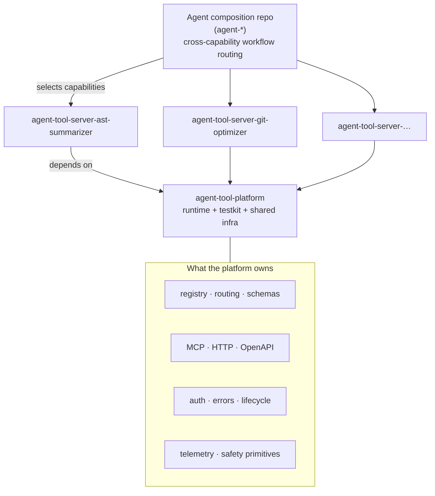

# agent-tool-platform

Shared runtime, testkit, and infrastructure primitives for the Hosted Agent Tool Servers project.

This repository is **not** a tool server, an agent, or a persona. It contains no domain behaviour:
no ASTs, no repositories, no Azure resources, no documents, no images. It is the layer every
`agent-tool-server-*` capability consumes so that authentication, transports, error semantics,
lifecycle, safety primitives, and routing grammar are implemented once and behave identically
everywhere.

> **Status: v0 foundation.** Nothing here has been published to npm and no infrastructure has been
> deployed. AST Summarizer is the planned first real consumer, in the next phase.

---

## The three layers

```
Agent client
   |
   v
agent-tool-platform runtime
   |
   +-- registry / routing / schemas
   +-- MCP / HTTP / OpenAPI
   +-- auth / errors / lifecycle
   +-- telemetry / safety primitives
   |
   v
Thin capability
   |
   +-- tools
   +-- services
   +-- domain policy
   +-- provider/local engine
```



| Layer      | Repositories          | Owns                                                                                                           |
| ---------- | --------------------- | -------------------------------------------------------------------------------------------------------------- |
| Platform   | `agent-tool-platform` | Transports, contracts, safety primitives, conformance suites, shared Bicep.                                    |
| Capability | `agent-tool-server-*` | Domain tools, services, schemas, routing content, safety policy, provider integrations, domain infrastructure. |
| Agent      | `agent-*`             | Capability selection, cross-capability workflows, routing policy, client packaging, agent-level telemetry.     |

Two rules follow from this and are worth stating plainly:

- **Tool-level routing belongs to capabilities.** A capability declares when its own tools apply.
- **Cross-capability workflow routing belongs to agent repositories.** The platform never learns
  that "run the Git tool before the AST tool".

Execution location is not an architectural boundary. A capability that runs locally over stdio, in
a container behind HTTP, or as a managed subprocess uses the same runtime and publishes the same
contracts. There is no central proxy and no combined server.

---

## Packages

| Package                                                      | Purpose                                                                               |
| ------------------------------------------------------------ | ------------------------------------------------------------------------------------- |
| [`@agent-tool-platform/runtime`](packages/runtime)           | The shared implementation a capability consumes at runtime.                           |
| [`@agent-tool-platform/testkit`](packages/testkit)           | Reusable conformance suites that prove a capability satisfies the platform contracts. |
| [`examples/minimal-capability`](examples/minimal-capability) | A private fixture used only to prove the platform. Never published, never a product.  |

The package count is small on purpose. Auth, routing, telemetry, errors, and process handling are
modules inside `runtime`, not separate packages: splitting them would buy version skew and nothing
else.

`testkit` may depend on `runtime`. `runtime` must never depend on `testkit`.

---

## How a thin capability consumes the runtime

```ts
import { defineAgentToolCapability } from '@agent-tool-platform/runtime';

export default defineAgentToolCapability({
  manifest,
  instructions,

  config: {
    schema: capabilityEnvSchema,
    build({ base, env }) {
      return { ...base, domain: { root: env.CAPABILITY_ROOT } };
    },
    validate(config) {
      // optional cross-field domain validation
    },
  },

  tools,

  createServices(context) {
    return services;
  },

  lifecycle: {
    async start(context) {},
    async stop(context) {},
  },

  readiness: [async (context) => ({ name: 'domain', state: 'ready' })],

  protectedRoutes: [],

  telemetry: {
    estimateInvocation(context) {
      return {};
    },
  },
});
```

An entry point is then three lines:

```ts
import { startAgentToolApplication } from '@agent-tool-platform/runtime';
import capability from './capability.js';

await startAgentToolApplication(capability);
```

`createAgentToolApplication(capability)` returns the assembled application without binding a
listener, which is what tests use.

### Who owns what

| The runtime owns                        | The capability owns             |
| --------------------------------------- | ------------------------------- |
| Application lifecycle                   | Domain configuration extension  |
| Logger construction and redaction       | Domain services                 |
| Base configuration                      | Domain tools                    |
| Authentication                          | Domain routing content          |
| Registry construction                   | Domain safety policy            |
| HTTP server                             | Domain readiness                |
| MCP servers (stdio and Streamable HTTP) | Genuine domain extension routes |
| OpenAPI generation                      | Domain telemetry estimates      |
| Readiness aggregation                   |                                 |
| Request identity                        |                                 |
| Rate limiting                           |                                 |
| Cancellation propagation                |                                 |
| Baseline invocation telemetry           |                                 |
| Normalized errors                       |                                 |

There is deliberately **no** universal `Services` interface and **no** single `AppConfig` union.
The capability definition is generic over both, so `AstServices` and `AzureServices` never have to
know each other exist.

---

## Tools and routing

```ts
export const getFileSkeleton = defineTool({
  name: 'get_file_skeleton',
  title: 'Get file skeleton',
  summary: 'Return a declaration-only view of one file.',
  description: 'Return exported declarations, signatures, and bounded documentation.',
  kind: 'read',
  routing: {
    useWhen: ['you need a file API before reading its implementation'],
    doNotUseWhen: ['you need runtime behaviour; every body is removed'],
    prerequisites: [],
    nextSteps: ['get_dependency_graph'],
    scope: 'one workspace root',
    changesState: false,
  },
  inputSchema,
  outputSchema,
  async handler(input, services, context) { … },
});
```

The registry is the single source of truth. It:

- rejects duplicate and malformed tool names,
- validates every input **and** every output through Zod,
- generates input and output JSON Schema,
- normalizes handler failures through the shared error model,
- never returns invalid handler output to a caller, and never names the offending value,
- retains both the declared description and the rendered agent-facing description,
- exposes routing metadata and resolved annotations through `list()`, `get()`, `has()`, `invoke()`.

Because every transport reads from that one registry, this invariant holds by construction and is
enforced by a test:

```
registry tool count == HTTP endpoint count == OpenAPI operation count == MCP tool count
```

Annotations default from `kind` (`read` → read-only and idempotent; `write` → destructive) and a
tool may override any of them. `scope` is optional free text; the platform has no opinion about
what a scope _is_, which is why nothing Azure-specific survived generalization.

---

## Errors

One bounded, transport-safe model with twelve codes:

`bad_request` · `unauthorized` · `forbidden` · `not_found` · `conflict` · `limit_exceeded` ·
`rate_limited` · `not_ready` · `busy` · `timeout` · `upstream_error` · `internal_error`

- Messages and details are bounded in both breadth and width.
- HTTP status and retryability are mapped centrally.
- `toPayload(requestId)` never carries a stack, a cause, or an absolute path.
- An unmapped exception becomes a generic `internal_error`; its text is kept server-side as `cause`
  and never sent, because arbitrary exception text is where connection strings and file paths live.

---

## Configuration

`PlatformConfig` owns environment normalization, service metadata, HTTP settings, auth mode, log
level, and the generic mutation policy. A capability extends it:

```ts
export const capabilityConfig = defineCapabilityConfig({
  schema: capabilityEnvSchema,
  build: ({ base, env }) => ({ ...base, domain: { … } }),
  validate: (config) => { /* cross-field invariants */ },
});
```

Blank variables behave as unset, booleans are strict rather than truthy, and `AUTH_MODE=disabled`
is refused in production.

### Platform environment variables

Everything below is read by the runtime itself. A capability adds its own variables through its
schema and never has to redeclare these.

| Variable                                  | Default             | Purpose                                                                   |
| ----------------------------------------- | ------------------- | ------------------------------------------------------------------------- |
| `NODE_ENV`                                | `development`       | `development`, `test`, or `production`. Production forbids disabled auth. |
| `HOST` / `PORT`                           | `0.0.0.0` / `8080`  | Listener address.                                                         |
| `LOG_LEVEL`                               | `info`              | Pino level.                                                               |
| `SERVICE_NAME` / `SERVICE_VERSION`        | capability manifest | Overrides the capability's declared identity.                             |
| `GIT_SHA`                                 | `unknown`           | Reported by `/version`.                                                   |
| `PUBLIC_BASE_URL`                         | —                   | Advertised as the OpenAPI server URL.                                     |
| `BODY_LIMIT_BYTES`                        | `1000000`           | Maximum request body.                                                     |
| `TRUST_PROXY`                             | `false`             | Boolean, hop count, or CSV of trusted addresses.                          |
| `RATE_LIMIT_MAX` / `RATE_LIMIT_WINDOW_MS` | `120` / `60000`     | Per-principal fair-use budget. `0` disables.                              |
| `PRE_AUTH_RATE_LIMIT_MAX`                 | `30`                | Pre-auth abuse budget, keyed by address.                                  |
| `REQUEST_TIMEOUT_MS`                      | `0`                 | Per-request deadline. `0` disables.                                       |
| `SHUTDOWN_GRACE_MS`                       | `10000`             | Grace period before a signal-driven shutdown gives up.                    |
| `AUTH_MODE`                               | `api-key`           | `api-key`, `entra-jwt`, or `disabled`.                                    |
| `API_KEYS`                                | —                   | CSV. Each key must be a high-entropy random token.                        |
| `ENTRA_TENANT_ID` / `ENTRA_AUDIENCE`      | —                   | Required for `entra-jwt`.                                                 |
| `ENTRA_ALLOWED_APP_IDS`                   | —                   | Optional CSV allow-list of calling applications.                          |
| `ENTRA_CLOCK_TOLERANCE_SECONDS`           | `60`                | Skew tolerance for token validation.                                      |
| `ENTRA_JWKS_URI`                          | tenant discovery    | Override for the key set endpoint.                                        |
| `MUTATIONS_ENABLED`                       | `false`             | Whether state-changing tools may execute at all.                          |
| `MUTATION_CONFIRMATION_REQUIRED`          | `true`              | Whether execution requires explicit confirmation.                         |

---

## Authentication

One contract, three modes:

| Mode        | Behaviour                                                                                                                                                                |
| ----------- | ------------------------------------------------------------------------------------------------------------------------------------------------------------------------ |
| `api-key`   | Fixed-width keyed HMAC comparison, minimum-entropy enforcement at configuration time, safe fingerprint as the principal id. No length oracle, no raw credential in logs. |
| `entra-jwt` | Remote JWKS, both Entra issuer forms, exact audience match, clock tolerance, optional calling-application allow-list.                                                    |
| `disabled`  | Anonymous principal. Allowed locally, refused in production.                                                                                                             |

`Authenticator` does not depend on Fastify. The HTTP layer adapts a Fastify request into a small
transport-neutral `AuthenticationRequest`, so a future transport, or a test, can authenticate
without an HTTP framework.

---

## HTTP surface

| Public              | Protected                    |
| ------------------- | ---------------------------- |
| `GET /health`       | `GET /tools`                 |
| `GET /ready`        | `POST /tools/:toolName`      |
| `GET /version`      | `GET`, `POST`, `DELETE /mcp` |
| `GET /openapi.json` | capability extension routes  |

Installed centrally, once: request identity, `cache-control: no-store`, body ceiling, proxy trust,
error normalization, authentication, two rate-limit budgets, retry-after, invocation logging,
cancellation on disconnect, and lifecycle awareness.

### Two rate-limit budgets

Authenticated traffic is charged to a **per-principal** fair-use budget. Traffic that cannot
authenticate is charged to a separate **pre-auth abuse** budget keyed by address. Keeping them
apart is what stops one unauthenticated caller from consuming another principal's quota.

Rate-limit state is **in-process** for v0. Two replicas each admit the configured maximum; this is
a fair-use and abuse control, not a distributed quota.

### Protected extension routes

A capability receives an **already-protected** router — authentication, rate limiting, request
identity, and error handling are installed before it sees the scope:

```ts
protectedRoutes: [
  (router, { services, config, logger }) => {
    router.get('/assets/:id', async (request) => services.assets.head(request.params.id));
  },
],
```

This exists for genuine cases such as streaming asset endpoints or safe aggregate metrics. Public
extension routes are a separate, explicit mechanism, so exposing something unauthenticated is
always a deliberate act.

---

## MCP

Both stdio and stateless Streamable HTTP are served from the **same registry and the same services**
as HTTP. Server-wide `instructions` are published through initialization. Each tool publishes its
name, title, rendered description, input schema, output schema, and annotations verbatim from the
registry, so an MCP client and an OpenAPI client cannot see different contracts.

Streamable HTTP stays stateless: no session id is issued, none is required, and there is no session
database. Transports and servers are closed on every path, including failure, so nothing leaks.

`ToolInvocationContext.transport` is always accurate: `http`, `mcp-stdio`, or `mcp-http`.

---

## OpenAPI

OpenAPI 3.1, derived from the registry rather than maintained beside it. One POST operation per
tool, `operationId` equal to the tool name, request and response schemas taken from the registry,
annotations and routing surfaced as extensions, shared platform error responses, and a security
scheme derived from the configured auth mode. Write tools are marked
`x-openai-isConsequential: true`; read tools are not.

---

## Lifecycle, readiness, and cancellation

Application states: `starting → ready → draining → stopped`. This is the _application_ state
machine. A capability's own domain state machine — Doc RAG's index manager, for example — stays
the capability's and is merely connected through `start` and `stop` hooks.

Readiness contributors return `{ name, state: 'ready' | 'degraded' | 'not_ready', detail? }` and the
platform aggregates them for `/ready`. `degraded` stays in rotation, because removing a working
replica over a warning is its own outage. Results are cached and concurrent probes share one
evaluation, so a public probe cannot amplify into expensive work. Detail strings are bounded and a
contributor that throws collapses into an opaque failure, because `/ready` is public.

Cancellation composes application shutdown, HTTP disconnect, and any configured request deadline
into a single signal. `ToolInvocationContext.signal` is never optional.

---

## Safety primitives

**Concurrency** — `BoundedSemaphore` and `BoundedQueue`. Both are kept: a CPU-bound capability
wants small concurrency with fast rejection, a subprocess capability wants explicit admission with a
visible backlog. Saturation is a retryable `busy`, never unbounded memory. A caller that
disconnects while queued releases its slot immediately.

**Root boundary** — canonicalize, then check containment, then operate on the canonical path.
Symlinks are resolved _before_ containment is checked, so a link whose target escapes is rejected
rather than followed. No capability policy lives here: supported extensions, repository semantics,
allowed source kinds, and image rules are all composed on top by the capability.

**Safe process execution** — `buildChildEnvironment`, `resolveExecutable`, `runBoundedProcess`.
The child environment is an **allowlist built from scratch**, not a filtered copy, so application
secrets cannot reach a child; there is a regression test proving it. No shell, ever. Timeouts,
cancellation, bounded stdout and stderr, and deterministic cleanup are the platform's; which
executables and which argv are permitted is the capability's.

> This is a library primitive for trusted capability code. It is **not** exposed as a tool and must
> never become a generic remote command-execution interface.

**Mutation gate** — only the generic behaviour: a preview is always allowed, execution requires
mutations to be enabled, and confirmation is enforced when required. Azure subscription
allow-lists, ARM identifiers, deployment scope validation, and Bicep scope rules stay in the Azure
capability.

---

## Telemetry

Intentionally minimal. There is a contract and a no-op default sink, and nothing else: no
Application Insights wiring, no Log Analytics, no workbook, no rollup, no dashboards.

The runtime records, without any capability cooperation: capability, capability version, tool,
transport, outcome, error code, and duration. A capability may add an `InvocationMeasurement`
(`sourceBytes`, `outputBytes`, `rawEquivalentTokens`, `resultTokens`, `estimatedTokensAvoided`,
`truncated`, `fallback`) through `telemetry.estimateInvocation`.

Nothing else is recorded, and the contract makes it awkward to try: no prompts, source, arguments,
results, file paths, filenames, resource identifiers, or credentials. Measurements are sanitized to
known numeric and boolean fields before they reach a sink, and a sink or estimator that throws can
never fail a tool call.

The single goal for v0 is to establish the contract the eventual "estimated context avoided"
counter needs.

---

## Testkit

```ts
import { runRegistryConformance, runHttpConformance } from '@agent-tool-platform/testkit';

it('satisfies platform registry conformance', async () => {
  await runRegistryConformance({ registry, services });
});
```

Available suites: `runRegistryConformance`, `runRoutingConformance`, `runHttpConformance`,
`runMcpConformance`, `runOpenApiConformance`, `runTransportParity`, `runAuthConformance`,
`runConfigConformance`, `runLifecycleConformance`, `runRootBoundaryConformance`,
`runProcessConformance`, `runMetadataConformance`.

The testkit imports no test runner, so each suite runs inside whichever `it(...)` a capability
already uses. Every suite tests **platform** invariants only; domain behaviour stays in the
capability's own tests.

Metadata validation is also available as a binary for capability repositories:

```bash
npx agent-tool-validate-metadata --server server.json --package package.json
```

---

## Shared infrastructure

Account-neutral Bicep modules under [`infra/`](infra): identity, container registry, key vault,
observability, a generic Container App, and private blob storage. See
[`infra/README.md`](infra/README.md).

**How capability repositories will consume versioned modules is deliberately unresolved.** No Git
submodules have been introduced, nothing has been published to a registry, and the modules have not
been copied back into any capability. The candidate mechanisms and the decision criteria are
documented in `infra/README.md`.

---

## Development

```bash
npm install
npm run typecheck
npm run test:coverage
npm run build
npm run package:smoke
npm run openapi:emit
npm run metadata:validate
```

Coverage floor: 80% lines, 80% functions, 80% statements, 70% branches.

---

## Non-goals for v0

This repository deliberately does **not**:

- migrate AST Summarizer or any other capability,
- modify `agent-tool-server-template` or any sibling repository,
- create `agent-developer-optimization` or any agent repository,
- create agent manifest or lockfile tooling,
- implement a telemetry backend, Application Insights, or Log Analytics provisioning,
- publish packages to npm,
- deploy infrastructure,
- implement the Vision TypeScript wrapper,
- choose a cross-repository Bicep distribution mechanism,
- introduce Git submodules,
- expose any arbitrary-shell or arbitrary-command interface,
- create a central routing proxy, a universal provider abstraction, or an inheritance hierarchy.

## Next: AST Summarizer migration

AST Summarizer is the planned first real consumer. It will import the runtime's error model,
credential handling, cancellation, semaphore, limits, root boundary, registry, transports, OpenAPI
generation, telemetry seam, and testkit conformance suites, and keep its compiler, projector,
dependency graph, language handling, and file policy entirely to itself.

## License

MIT. See [LICENSE](LICENSE).
